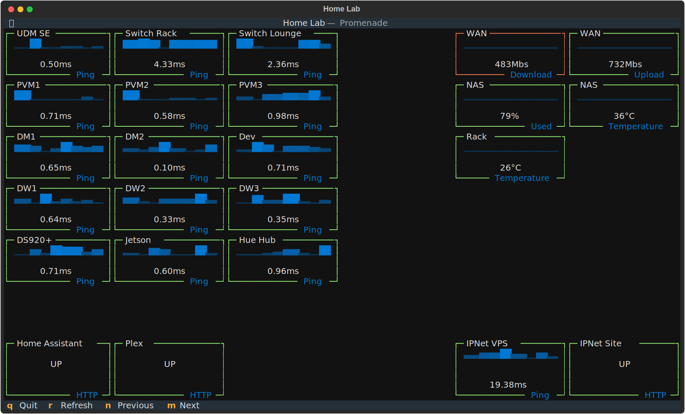

# Promenade

A powerful, customizable CLI dashboard for Prometheus metrics built with Python and Textual.



## Features

- 📊 **Grid-based Layout**: Flexible grid system for organizing widgets
- 🎨 **Conditional Formatting**: Dynamic styling based on metric values
- 🔄 **Auto-refresh**: Configurable refresh intervals per dashboard
- 🎯 **Custom Queries**: Full PromQL support
- 🎠 **Multi-Dashboard Carousel**: Navigate between multiple dashboards with keyboard shortcuts
- 🌈 **Theme Support**: Respects Textual themes
- ⚡ **Fast & Lightweight**: Built on Textual framework
- 📝 **YAML Configuration**: Simple, declarative dashboard definitions
- 🏷️ **Widget Titles & Subtitles**: Customizable border titles and subtitles

## Requirements

- Python 3.12+
- Prometheus server

## Installation

### Using UV (Recommended)

```bash
# Install dependencies
uv sync

# Activate virtual environment (if needed)
source .venv/bin/activate  # On Linux/macOS
# or
.venv\Scripts\activate  # On Windows
```

### Development Installation

For development work:

```bash
# Install dependencies including dev tools
uv sync

# Install pre-commit hooks
uv run pre-commit install
```

### Alternative: Using pip

```bash
# Create virtual environment
python -m venv .venv
source .venv/bin/activate

# Install the package
pip install -e ".[dev]"

# Set up pre-commit hooks
pre-commit install
```

## Quick Start

1. **Start your Prometheus server** (if not already running)

2. **Create a dashboard configuration** (see `examples/example.yaml`)

3. **Run the dashboard**:

```bash
# Using environment variable
export PROMETHEUS_URL=http://localhost:9090
promenade examples/example.yaml

# Or using command-line argument
promenade examples/example.yaml --prometheus-url http://localhost:9090

# Multiple dashboards (carousel mode)
promenade dashboard1.yaml dashboard2.yaml dashboard3.yaml
```

## Configuration

### Dashboard YAML Format

```yaml
title: "My Dashboard"
refresh_interval: 30  # Refresh all widgets every 30 seconds
grid_rows: 3          # Number of rows in the grid
grid_columns: 3       # Number of columns in the grid

widgets:
  - title: "CPU Usage"                    # Optional widget title (top border)
    subtitle: "System"                    # Optional subtitle (bottom-right border)
    query: "100 - (avg(rate(...)) * 100)" # PromQL query
    format_string: "{value:.1f}%"         # Python format string
    row: 0                                 # Grid position (0-indexed)
    column: 0
    row_span: 1                            # Span multiple rows/columns
    column_span: 1
    border_style: "rounded"                # Border style
    conditional_formats:                   # Conditional formatting rules
      - condition: "value > 80"
        border_color: "red"
        text_color: "red"
```

### Widget Configuration

| Field | Type | Required | Default | Description |
|-------|------|----------|---------|-------------|
| `type` | string | No | `text` | Widget type: `text`, `digits`, `sparkline`, `progress` |
| `title` | string | No | - | Widget title displayed in top border |
| `subtitle` | string | No | - | Subtitle displayed in bottom-right border |
| `query` | string | Yes | - | PromQL query to execute |
| `format_string` | string | No | `{value}` | Python format string for display |
| `row` | integer | Yes | - | Row position (0-indexed) |
| `column` | integer | Yes | - | Column position (0-indexed) |
| `row_span` | integer | No | 1 | Number of rows to span |
| `column_span` | integer | No | 1 | Number of columns to span |
| `border_style` | string | No | `solid` | Border style: `none`, `solid`, `dashed`, `double`, `heavy`, `rounded` |
| `conditional_formats` | array | No | [] | List of conditional formatting rules |

#### Widget Types

**`text`** (default) - Simple text display
- Standard metric display with formatted text
- Supports all conditional formatting options

**`digits`** - Large numeric display
- Shows metrics in large, prominent multi-line characters
- Ideal for important metrics you want to stand out
- Best for numeric values

**`sparkline`** - Time series trend visualization
- Displays historical metric values as a compact bar chart
- Automatically updates with new data points
- Additional options:
  - `sparkline_summary`: Summary function (`max`, `min`, `mean`) - default: `max`
  - `sparkline_data_points`: Number of historical points to keep - default: `20`

**`progress`** - Progress bar display
- Shows metrics as a progress bar with optional percentage
- Additional options:
  - `progress_total`: Total value for progress bar (if `None`, treats value as 0-100%) - default: `100`
  - `show_percentage`: Display percentage - default: `true`
  - `show_eta`: Display ETA (always `false` for static metrics) - default: `false`

### Conditional Formatting

Conditional formats are evaluated in order and applied when their condition is met:

```yaml
conditional_formats:
  - condition: "value > 80"           # Python expression with 'value' variable
    border_color: "$error"             # Theme color (recommended) or CSS color
    text_color: "$error"               # Also accepts: "red", "#ff0000", etc.
    background_color: "$surface"
    visible: true                      # Control widget visibility
```

**Available condition expressions:**
- Numeric comparisons: `value > 80`, `value <= 50`
- Complex logic: `value > 50 and value < 80`
- Any valid Python expression with `value` variable

**Color options:**

**Recommended: Use Textual theme colors** (automatically adapt to any theme):
- `$success` - Success/positive states (green in dark, dark green in light)
- `$error` - Error/negative states (red in dark, dark red in light)
- `$warning` - Warning states (yellow/orange)
- `$primary` - Primary theme color
- `$secondary` - Secondary theme color
- `$accent` - Accent color for highlights

**Alternative: Standard colors** (automatically adjusted for theme):
- CSS color names: `red`, `lime`, `blue`, `yellow`, etc.
- Hex codes: `#ff0000`, `#00ff00`, `#ffaa00`
- ANSI colors: `ansi_red`, `ansi_green`, `ansi_yellow`, `ansi_blue`
- Rich color library: Over 140 named colors available (see [Textual color documentation](https://textual.textualize.io/api/color/))

**Automatic Theme Adjustment:**
- **Theme colors** (`$success`, `$error`, etc.): Automatically perfect for any theme - **Recommended!**
- **Standard colors**: Automatically adjusted for visibility:
  - Dark themes: Brightened by 30%
  - Light themes: Darkened by 30-70% based on color brightness
  - Ensures visibility across all themes

## Environment Variables

| Variable | Description | Default |
|----------|-------------|---------|
| `PROMETHEUS_URL` | Prometheus server URL | - |
| `PROMETHEUS_TIMEOUT` | Request timeout in seconds | 10 |

## CLI Usage

```bash
promenade [OPTIONS] CONFIG_FILES...

Arguments:
  CONFIG_FILES  Path(s) to YAML dashboard configuration file(s)
                Multiple files create a carousel of dashboards

Options:
  -u, --prometheus-url TEXT  Prometheus server URL
  -t, --theme TEXT          Textual theme (default: textual-dark)
  -h, --help                Show help message
```

### Keyboard Shortcuts

- `q` - Quit the application
- `r` - Refresh all metrics on current dashboard immediately
- `←` or `n` - Previous dashboard (in carousel mode)
- `→` or `m` - Next dashboard (in carousel mode)

## Examples

See the `examples/` directory for sample configurations:

- `example.yaml` - Full-featured home lab monitoring dashboard
- `widget_types.yaml` - Demonstrates all widget types (text, digits, sparkline, progress)

### Example: System Monitoring Dashboard

```yaml
title: "System Monitor"
refresh_interval: 5
grid_rows: 2
grid_columns: 2

widgets:
  - title: "CPU Usage"
    subtitle: "System"
    query: "100 - (avg(rate(node_cpu_seconds_total{mode='idle'}[5m])) * 100)"
    format_string: "{value:.1f}%"
    row: 0
    column: 0
    conditional_formats:
      - condition: "value > 80"
        border_color: "$error"
        text_color: "$error"

  - title: "Memory Usage"
    subtitle: "System"
    query: "(1 - (node_memory_MemAvailable_bytes / node_memory_MemTotal_bytes)) * 100"
    format_string: "{value:.1f}%"
    row: 0
    column: 1
    conditional_formats:
      - condition: "value > 90"
        border_color: "$error"

  - title: "Active Connections"
    subtitle: "Nginx"
    query: "sum(nginx_connections_active)"
    format_string: "{value:.0f}"
    row: 1
    column: 0
    row_span: 1
    column_span: 2
```

## Development

### Project Structure

```
promenade/
├── src/promenade/
│   ├── __init__.py
│   ├── cli.py           # CLI entrypoint
│   ├── app.py           # Main Textual application
│   ├── config.py        # Configuration loader
│   ├── schema.py        # Pydantic models
│   ├── prometheus.py    # Prometheus client
│   └── widgets.py       # Custom Textual widgets
├── examples/            # Example dashboards
├── pyproject.toml       # Project configuration
└── README.md
```

### Running Tests

```bash
# Install test dependencies
uv pip install -e ".[dev]"

# Run tests
pytest
```

### Code Quality

```bash
# Run linter
ruff check .

# Run formatter
ruff format .

# Run type checker
mypy src/
```

## Troubleshooting

### Connection Issues

If you see connection errors:
1. Verify Prometheus is running: `curl http://localhost:9090/api/v1/query?query=up`
2. Check the Prometheus URL is correct
3. Ensure there are no firewall restrictions

### Query Errors

If widgets show "No data":
1. Test your query in Prometheus UI
2. Verify metric names exist
3. Check query syntax in PromQL

### Display Issues

If widgets overlap or don't fit:
1. Check `grid_rows` and `grid_columns` match your layout
2. Verify `row + row_span <= grid_rows`
3. Verify `column + column_span <= grid_columns`

## Contributing

Contributions are welcome! Please:

1. Fork the repository
2. Create a feature branch
3. Make your changes
4. Run tests and linters
5. Submit a pull request

## License

MIT License - see LICENSE file for details

## Acknowledgments

- Built with [Textual](https://textual.textualize.io/)
- Inspired by Prometheus monitoring needs
- Thanks to the Python community
